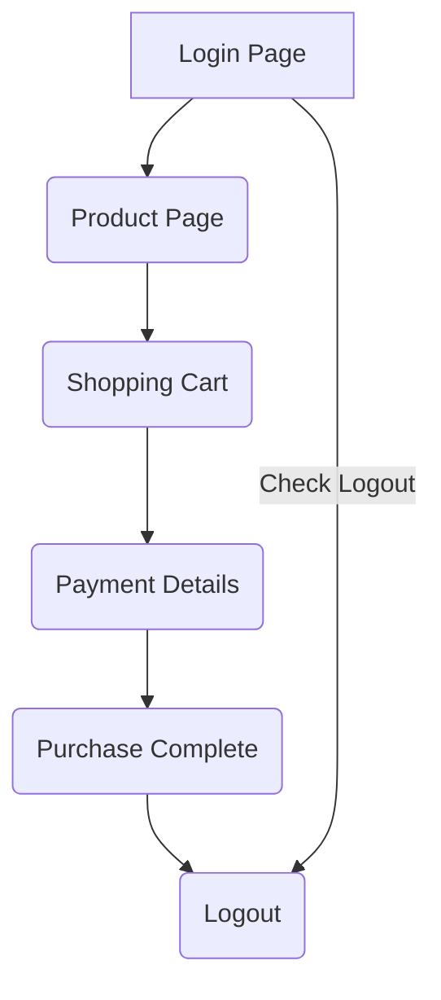

# Global QA Test

## Contents 

[Introduction](#introduction)

[API](#api)

[API Background](#background)

[API Preamble](#preamble)

[Get All Launches](#1getalllaunches)

[Update Limit Parameter](#2updatelimitparam)

[Update Offset Parameter](#3updateoffsetparam)

[UI](#ui)

[Cypress](#cypress)

[Cypress - Requirements](#requirements)

[Cypress -  Running the Tests](#running-the-tests)

[Cypress - Approach](#approach)

[Cypress - Things to Note](#things-to-note)

[Playwright](#playwright)

[Playwright - Background](#background-1)

[Playwright - Requirements](#requirements-1)

[PLaywright - Running the Tests](#running-the-tests-1)

[Playwright - Approach](#approach-1)

[Playwright - Things to Note](#things-to-note-1)


## Introduction 

This repo contains both the API and the UI elements of the test.  I have made available a Jenkins Instance to facilitate running the API tests.  The UI tests are best run (at the moment) locally.

To access the API tests, please navigate to http://18.132.250.17:8080/ and use the username **globalUser** and password is "**password**" (no quotes)

There will be a single project available - **SpaceX Land for Global**

This project will have the option to build as well as the option to view some Junit style test reports.


## API ##

### Background ###

I am unfamiliar with GraphQL, so these queries and the resulting tests may not be the best way to do it, given the time, it was the best I could do.  I was unsure of the first and last stage part - I found references to the first and last stage in the rocket section of the launches query, but these differed.  As this was the weekend, I could not ask questions.  I have left those parts out of this assignment.

#### Preamble

The collection is setup to send the queries to the SpaceX endpoint.  No authentication was used or needed.  All bodies for the queries are of type GraphQL

#### 1_getAllLaunches

**body**
```gql
query launches {
  launches {
    id
    mission_name
    ships {
      name
    }
  }
}
```

**Tests**
```javascript
// check status code
pm.test("Status code is 200", function () {
    pm.response.to.have.status(200);
});

// check mission name is not empty
pm.test('Check Mission Name is not empty', () => {
    var data = pm.response.json().data.launches;

    checkEmpty = data.filter(name => name["mission_name"] == "")
    pm.expect(checkEmpty, JSON.stringify(checkEmpty)).to.be.empty
});

// check that number of launches is greater than 0
pm.test('Check that number of launches is greater than 0', () => {
    var data = pm.response.json().data.launches;
    pm.expect(data.length).to.be.above(0)
});

// check the number of ships is greater than 0
// fails as there are 31 launches without ships
pm.test('Check Number of ships is greater than 0', () => {
    var data = pm.response.json().data.launches;

    checkShips = data.filter(name => name["ships"] == 0)
    pm.expect(checkShips.length, JSON.stringify(checkShips)).to.equal(0)

});

// check that first and second stage are not null


```

**Test Output**

-  `PASS` Status code is 200
-  `PASS` Check Mission Name is not empty
-  `PASS` Check that number of launches is greater than 0
-  `FAIL` Check Number of ships is greater than 0

The final test fails as there are 31 instances of launches with no ships.  This as been verified by opening up pasting the output into VSCode and searching for ```"ships": []``` and 31 instances were found.  My logic is that we expect all launches to have some ships.  Therefore the JavaScript I wrote will return an array where we find all the launches with empty ships.  This should be 0.  We get 31.

#### 2_updateLimitParam

This test uses GraphQL a variable to modify the limit

**body**
```gql
query ($limit: Int!) {
  launches(limit: $limit) {
    id
    mission_name
    ships {
      name
    }
  }
}
```

**variables**
```json
{
    "limit": 2
}
```

**Tests**

*These tests are **almost** the same as the previous*
```javascript
// check status code
pm.test("Status code is 200", function () {
    pm.response.to.have.status(200);
});

// check mission name is not empty
pm.test('Check Mission Name is not empty', () => {
    var data = pm.response.json().data.launches;

    checkEmpty = data.filter(name => name["mission_name"] == "")
    pm.expect(checkEmpty, JSON.stringify(checkEmpty)).to.be.empty
});

// check that number of launches is greater than 0
pm.test('Check that number of launches is greater than 0', () => {
    var data = pm.response.json().data.launches;
    pm.expect(data.length).to.be.above(0)
});

// check the number of ships is greater than 0
// fails as there are 31 launches without ships
pm.test('Check Number of ships is greater than 0', () => {
    var data = pm.response.json().data.launches;

    checkShips = data.filter(name => name["ships"] == 0)
    pm.expect(checkShips.length, JSON.stringify(checkShips)).to.equal(0)
});

// check that number of launches is 2
pm.test('Check that number of launches is 2 (current gql variable)', () => {
    var data = pm.response.json().data.launches;
    pm.expect(data.length).to.equal(2)
});

// check that first and second stage are not null
```

**Test Output**

-  `PASS` Status code is 200
-  `PASS` Check Mission Name is not empty
-  `PASS` Check that number of launches is greater than 0
-  `FAIL` Check Number of ships is greater than 0
-  `PASS` Check that number of launches is 2 (current gql variable)

I have added an additional test in here - we can check that the limit is being respected by ensuring that only 2 launches are present.  
This approach has the value hard coded, I couldn't find a way to use any environment variables (or similar) which would make this test a bit more robust.

#### 3_updateOffsetParam

This test uses GraphQL a variable to modify the offset

**body**
```gql
query ($offset: Int!) {
  launches(offset: $offset) {
    id
    mission_name
    ships {
      name
    }
  }
}
```

**variables**
```json
{
    "offset": 11
}
```

**Tests**

```javascript

// check status code
pm.test("Status code is 200", function () {
    pm.response.to.have.status(200);
});

// check mission name is not empty
pm.test('Check Mission Name is not empty', () => {
    var data = pm.response.json().data.launches;

    // checkEmpty = data.filter((data) => _.isEqual(data["mission_name"], []))
    checkEmpty = data.filter(name => name["mission_name"] == "")
    pm.expect(checkEmpty, JSON.stringify(checkEmpty)).to.be.empty
});

// check that number of launches is greater than 0
pm.test('Check that number of launches is greater than 0', () => {
    var data = pm.response.json().data.launches;
    pm.expect(data.length).to.be.above(0)
});

// check the number of ships is greater than 0
// fails as there are 31 launches without ships
pm.test('Check Number of ships is greater than 0', () => {
    var data = pm.response.json().data.launches;

    checkShips = data.filter(name => name["ships"] == 0)
    pm.expect(checkEmpty, JSON.stringify(checkShips)).to.be.above(0)
});

// check that number of launches is 100
pm.test('Check that number of launches is 100 (111 at present minus gql variable)', () => {
    var data = pm.response.json().data.launches;
    pm.expect(data.length).to.equal(100)
});
```

**Test Output**
-  `PASS` Status code is 200
-  `PASS` Check Mission Name is not empty
-  `PASS` Check that number of launches is greater than 0
-  `FAIL` Check Number of ships is greater than 0
-  `PASS` Check that number of launches is 2 (current gql variable)

I have added an additional test here - it is hardcoded, which is not great.  The test is checking the number of results.  We know that we get 111 launches (at this time) and if we offset by 11 then we should get 100 launch records back.

I did try to make this test a bit smarter.
I had created the following in the pre-request script tab of postman
```javascript
var resultsBeforeOffset = 0;

const gqlQuery = {
    url: 'https://api.spacex.land/graphql/',
    method: 'POST',
    header: {
        'content-type': 'application/json',
        },
    body: JSON.stringify({
        query: 'query  { launches { id mission_name ships {  name } } }'        
    })
};
 

 pm.sendRequest(gqlQuery, function(err, response) {
    pm.expect(response.code).to.eql(200);
    
    console.log(response)
    // pm.variables.set("resultsBeforeOffset", response.json().length);
    // console.log("There are " + pm.variables.get("resultsBeforeOffset") + " results before offset."); 
 });
```
The idea was to find the number of launches and then store this in a variable.  In the new test, I would retrieve this and, at the moment, hard code the offset in a subtraction to get  the number of launches with the offset applied:

launches (post offset) = original launches - offset

However, it seems that the API wants to return a stream, which the pre-request is having issues with.  The code is present in the collection, but commented out.

## UI
I chose Cypress due to familiarity with that framework to do the largest part of the test.  However, there is also a playwright test (which is not as large as the Cypress one - I will cover that in its' own section)

### Cypress

Located in the **ui/cypress** folder.

#### Requirements
I used node 14.15.2 when creating these tests.  It is recommended to have that version as no warranties can be made for higher / lower versions.

#### Running the tests
These tests can be invoked by going into the **ui/cypress** folder and using the command 

**npm test**

This command has been configured in package.json to launch the test with the allure env variable set (to allow producing an allure report.)

#### Approach
After looking at the site, I have decided upon the following user journey:



This looks to be a very simple user journey.  

In addition to this, I have implemeted some other checks:
* Within the Login Page:
   * Checking the various element (username field, password field and the login button) are present.
   * Error message for missing username
   * Error message for missing password
   * Error message for logging in with a locked account
   * Checking the "performance glitch" user logs in
* A Logout test has also been created
   * Ensures the standard user can logout
   * Ensures the "performance glitch" user can logout
* The Products page tests check that the sidebar opens and closes
* Finally the user journey is as the left branch of the diagram.  Completes a purchase and ends with the user having logged out.

I have stored the user login credentials as a fixture called swagCredentials.json.  In addition, as I had never used Cucumber within Cypress, I decided to override most of the cypress commands which were being used.  This was for 2 reasons:
1.  The new names are more readable - so anyone can follow the flow without having to understand too much of the code.
2.  I wanted to ass a report - allure in this case - and then could add step descriptions add some readability to the report.

#### Things to note

In the end to end test, where the user has to change the sorting to high to low, I do an initial check for number of products (6) by looking for the elements which have a class of "**inventory_item**".  I then saw that the "Add to Cart" buttons all have unique identifiers - but if this this is to tbe a true test we do not use these (as this would ignore the ordering) - the buttons all have a class of **.btn.btn_primary.btn_small.btn_inventory** - looking at this in the console on any browser and entering 
```$$(.btn.btn_primary.btn_small.btn_inventory)```
yields an array of 6 items (note formatted for readability on GitHub):
```
(6)
[
  button#add-to-cart-sauce-labs-backpack.btn.btn_primary.btn_small.btn_inventory, 
  
  button#add-to-cart-sauce-labs-bike-light.btn.btn_primary.btn_small.btn_inventory, 
  
  button#add-to-cart-sauce-labs-bolt-t-shirt.btn.btn_primary.btn_small.btn_inventory, 
  
  button#add-to-cart-sauce-labs-fleece-jacket.btn.btn_primary.btn_small.btn_inventory, 
  
  button#add-to-cart-sauce-labs-onesie.btn.btn_primary.btn_small.btn_inventory, 
  
  button#add-to-cart-test.allthethings()-t-shirt-(red).btn.btn_primary.btn_small.btn_inventory
]
```
After applying the sort (Price high to low) and then rerunning the command in the console the output changes to be:
```
(6) 
[
  button#add-to-cart-sauce-labs-fleece-jacket.btn.btn_primary.btn_small.btn_inventory, 
  
  button#add-to-cart-sauce-labs-backpack.btn.btn_primary.btn_small.btn_inventory, 
  
  button#add-to-cart-sauce-labs-bolt-t-shirt.btn.btn_primary.btn_small.btn_inventory, 
  
  button#add-to-cart-test.allthethings()-t-shirt-(red).btn.btn_primary.btn_small.btn_inventory, 
  
  button#add-to-cart-sauce-labs-bike-light.btn.btn_primary.btn_small.btn_inventory, 
  
  button#add-to-cart-sauce-labs-onesie.btn.btn_primary.btn_small.btn_inventory]
```
So - to select the second most expensive would be the second item in this array, the item with index 1, and the cheapest would be item with index 5.  However, when writing the test index 5 would not work.  It was never found.  Debugging (in this case trying all the indexes one by one) showed that *index 4* returned the cheap item.  I have no explanation for this behaviour. 

### Playwright

#### Background

More out of curiosity, I decided to see what the differences with using Playwright to create some tests. 

I have recreated the end to end (though it is cut down with fewer checks) and some of the login tests (as they were useful to get a feel for the syntax.)

Located in the **ui/playwright** folder.

#### Requirements
I used node 14.15.2 when creating these tests.  It is recommended to have that version as no warranties can be made for higher / lower versions.

#### Running the tests
These tests can be invoked by going into the **ui/playwright** folder and using the command 

**npx playwright test**

#### Approach
As this was more of a spike for me, I didn't recreate the tests in full.  Only a few login tests and the end to end test have been redone with Playwright.  What I have noticed is that the Playwright tests do seem to run faster.

#### Things to note
As with the cypress test, when trying to add an item to the cart based on array position, the Playwright index do not make sense.  For the second highest, the index is 2 and the last item the index is 5.  This is something I will have to look at in future.